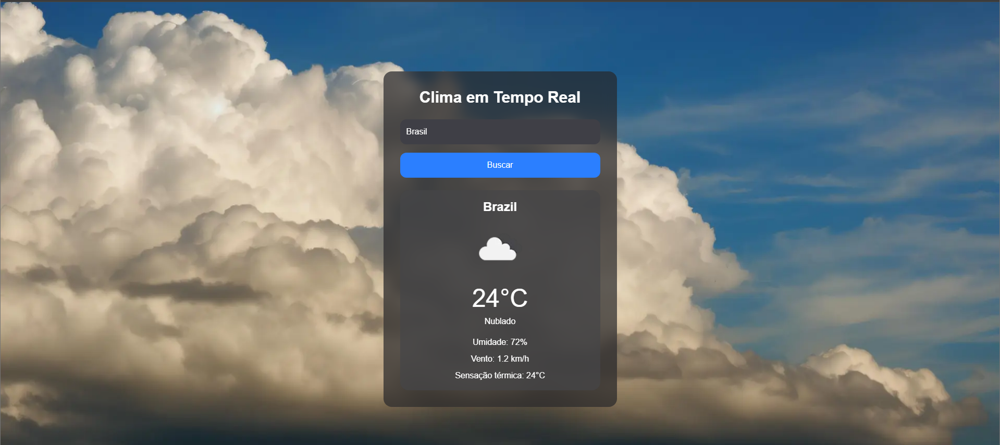

# 🌤️ Weather App

Aplicação de clima em tempo real desenvolvida com Next.js, TypeScript e TailwindCSS.

## 🚀 Tecnologias

- Next.js
- TypeScript
- TailwindCSS
- OpenWeather API

## ✨ Funcionalidades

- Buscar cidade
- Clima em tempo real
- Temperatura
- Umidade
- Velocidade do vento
- Fundo dinâmico
- Loading animado
- Responsivo



## 🔧 Como rodar

```bash
npm install
npm run dev